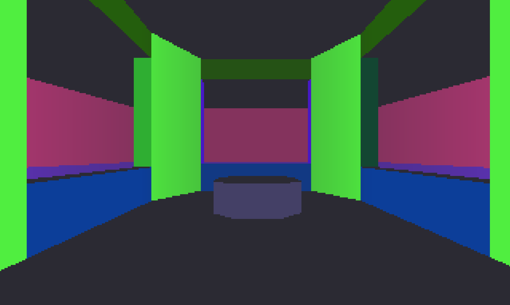
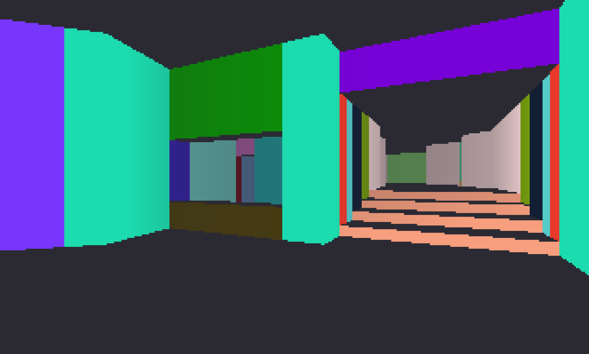
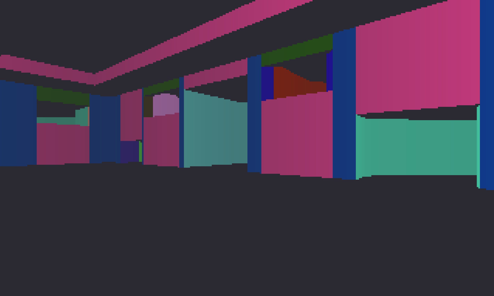
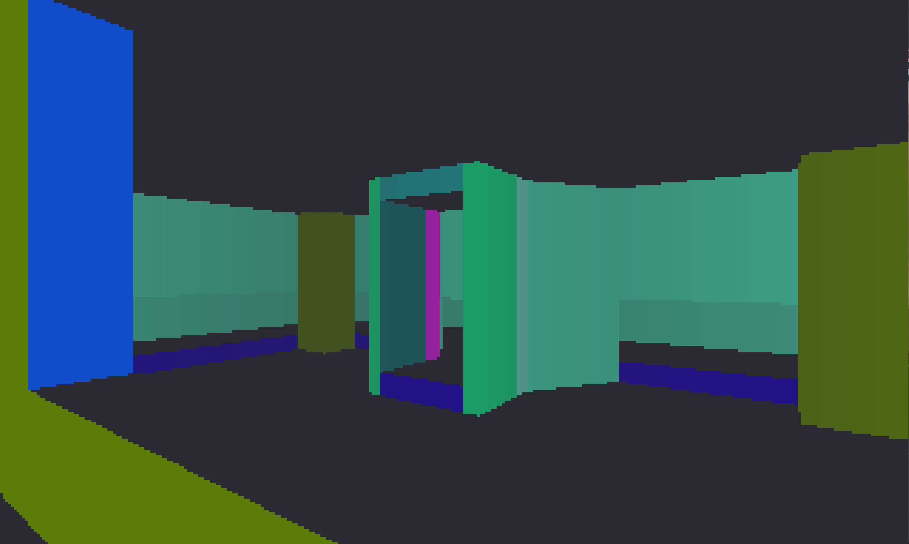

```
 _    _  ___   ___ ______ 
| |  | |/ _ \ / _ \| ___ \
| |  | | (_) | (_) | |_/ /
| |/\| |\___/ \___/|  __/ 
\  /\  /           | |    
 \/  \/            \_|  
```

## Overview
Woop is a DOOM-style rendering engine made to learn more about binary-space partitioning and early 3D rendering techniques!
It's written in C++17 and uses OpenGL as a rendering backend.

## Features
Woop is still being developed! See [issues](https://github.com/Quakken/woop/issues) for all planned features.
- Post-processing support via GLSL
- [TOML configuration](config.toml)
- Full WAD parsing
- Software rendering via OpenGL textures and PBOs
  - Occlusion culling
  - Front-to-back rendering via BSP traversal
- Basic player controller

## Getting Started
1. Clone this repository
2. [Build the project](#building-from-source)
3. Copy your DOOM wads to [assets/wads](build/src/assets/wads/)
    - Be sure to place them relative to the output executable ([build/src](build/src/) by default)
    - If this folder doesn't exist, create it!
    - If you don't own the original DOOM, many episodes have been distributed as shareware. You can find one such episode [here](https://archive.org/details/DoomsharewareEpisode).
4. Specify which wad/level to load in [config.toml](config.toml)
5. Launch the executable!


## Building from Source
Requirements:
- Your favorite C++17 compiler
- CMake v3.40 or higher

From the project's root directory, run the following:
```
mkdir build
cd build
cmake ..
cmake --build .
```

The output can then be found [here](build/src/)!

## Dependencies
Woop relies on a few external libraries to compile. These should be managed automatically via CMake.
- [GLFW](https://www.glfw.org/) - Windowing, input
- [GLAD](https://glad.dav1d.de/) - OpenGL function loading
- [GLM](https://glm.g-truc.net/) - Vector math
- [toml++](https://marzer.github.io/tomlplusplus/) - Config parsing

## Screenshots



